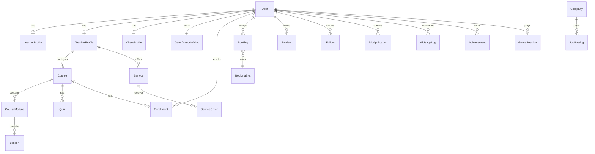

# Database Schema

PostgreSQL schema managed by Prisma. See `backend/prisma/schema.prisma` for the source of truth.

## Entity Relationship Diagram

## Core Tables

### users

| Column | Type | Notes |
|--------|------|-------|
| id | UUID PK | |
| email | VARCHAR UNIQUE | |
| password_hash | VARCHAR NULL | null if Google-only |
| role | ENUM | LEARNER, TEACHER, CLIENT, ADMIN |
| display_name | VARCHAR | |
| avatar_url | VARCHAR NULL | |
| google_id | VARCHAR NULL UNIQUE | |
| email_verified | BOOLEAN | default false |
| is_active | BOOLEAN | default true |
| created_at | TIMESTAMPTZ | |
| updated_at | TIMESTAMPTZ | |

### teacher_profiles

Extended profile for teachers/freelancers: bio, cover_image, skills (JSONB), experience, portfolio (JSONB), certifications, intro_video_url, social_links (JSONB), rating_avg, review_count, student_count, project_count, approved_at.

### courses

| Column | Type | Notes |
|--------|------|-------|
| id | UUID PK | |
| teacher_id | FK → users | |
| title | VARCHAR | |
| slug | VARCHAR UNIQUE | |
| description | TEXT | |
| category | ENUM | SOFTWARE_DEV, UI_UX, … |
| difficulty | ENUM | BEGINNER, INTERMEDIATE, ADVANCED |
| duration_minutes | INT | |
| skills | TEXT[] | |
| is_free | BOOLEAN | |
| price_cents | INT NULL | null if free |
| currency | VARCHAR(3) | default USD |
| thumbnail_url | VARCHAR | |
| status | ENUM | DRAFT, PENDING, PUBLISHED, ARCHIVED |
| source_type | ENUM | UPLOADED, YOUTUBE, EXTERNAL |
| external_url | VARCHAR NULL | |
| youtube_playlist_id | VARCHAR NULL | |

### enrollments

Tracks learner progress: `progress_percent`, `last_lesson_id`, `bookmarked`, `completed_at`.

### services (marketplace)

Freelance offerings: title, category, description, price_cents, delivery_days, faq (JSONB), portfolio (JSONB), status.

### bookings

Polymorphic reservations via `booking_type`: COURSE_SESSION, MENTORING, SERVICE, CLASSROOM.

Fields: provider_id, requester_id, scheduled_at, duration_minutes, capacity, status (PENDING, CONFIRMED, CANCELLED, COMPLETED), notes.

### job_postings

company_id, title, type (FULL_TIME, PART_TIME, INTERNSHIP, FREELANCE), location, remote, salary_min, salary_max, experience_level, description, status.

### gamification_wallets

user_id, coins, xp, level, current_streak, longest_streak, last_login_date.

### ai_usage_logs

user_id, date, interactions_count, coins_spent.

### achievements / badges

Platform-defined achievements; `user_achievements` junction with earned_at.

### reviews

Polymorphic: target_type (COURSE, TEACHER, SERVICE), target_id, rating 1–5, comment.

### follows

follower_id → following_id (teachers).

## Indexes

- `users(email)`, `users(google_id)`
- `courses(category, difficulty, status)`
- `courses` full-text on title + description (GIN)
- `services(category, status)`
- `job_postings(category, remote, status)`
- `bookings(scheduled_at, status)`

## Enums Reference

**UserRole**: LEARNER, TEACHER, CLIENT, ADMIN  
**CourseCategory**: SOFTWARE_DEV, UI_UX, GRAPHIC_DESIGN, DIGITAL_MARKETING, CYBERSECURITY, AI, LANGUAGES, BUSINESS, OTHER  
**Difficulty**: BEGINNER, INTERMEDIATE, ADVANCED  
**BookingStatus**: PENDING, CONFIRMED, CANCELLED, COMPLETED  
**JobType**: FULL_TIME, PART_TIME, INTERNSHIP, FREELANCE  
