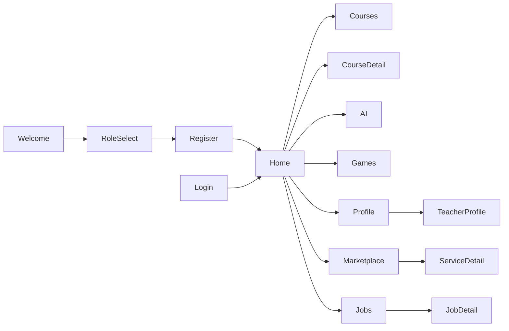

# Wireframes

Original layout concepts — **not** copies of reference mockups. Mobile-first (375×812 logical px).

## 1. Welcome & Onboarding

```
┌─────────────────────────────┐
│                             │
│      [Smooth logo mark]     │
│                             │
│   Learn. Create. Connect.   │
│                             │
│  ┌───────────────────────┐  │
│  │   Get Started         │  │
│  └───────────────────────┘  │
│  ┌───────────────────────┐  │
│  │ G  Continue with Google│  │
│  └───────────────────────┘  │
│      Already have account?  │
│           Sign in           │
└─────────────────────────────┘

Role Selection (after register):
┌─────────────────────────────┐
│ ←  Choose your path         │
│                             │
│ ┌─────────────────────────┐ │
│ │ 🎓 Learner              │ │
│ │ Explore courses & grow  │ │
│ └─────────────────────────┘ │
│ ┌─────────────────────────┐ │
│ │ 👩‍🏫 Teacher / Freelancer │ │
│ │ Teach, mentor, sell     │ │
│ └─────────────────────────┘ │
│ ┌─────────────────────────┐ │
│ │ 💼 Client               │ │
│ │ Hire talent & book      │ │
│ └─────────────────────────┘ │
└─────────────────────────────┘
```

## 2. Main Shell (Bottom Navigation)

```
┌─────────────────────────────┐
│ Smooth          🔍  🔔  🪙42│
├─────────────────────────────┤
│                             │
│     [ Tab content area ]    │
│                             │
├─────────────────────────────┤
│ 🏠    📚    🛒    💼    👤  │
│ Home Learn Market Jobs Profile│
└─────────────────────────────┘
```

Learner default tabs: Home, Learn, Games, AI, Profile  
Teacher adds: Dashboard tab variant  
Client emphasizes: Market, Jobs

## 3. Home (Learner)

```
┌─────────────────────────────┐
│ Good morning, Alex    Lv.5  │
│ ████████░░ 1,240 XP         │
├─────────────────────────────┤
│ Continue learning           │
│ ┌──────┐ Flutter Basics 45% │
│ │thumb │ Resume →          │
│ └──────┘                    │
├─────────────────────────────┤
│ Categories                  │
│ [Dev][Design][AI][Sec]…     │
├─────────────────────────────┤
│ Recommended for you         │
│ ┌────┐ ┌────┐ ┌────┐ →      │
│ │    │ │    │ │    │        │
│ └────┘ └────┘ └────┘        │
├─────────────────────────────┤
│ Daily streak 🔥 7 days      │
└─────────────────────────────┘
```

## 4. Course Library

```
┌─────────────────────────────┐
│ ← Courses        Filter ⚙   │
│ 🔍 Search courses…          │
├─────────────────────────────┤
│ [All][Free][Premium][Saved] │
├─────────────────────────────┤
│ ┌─────────────────────────┐ │
│ │ [img]  UI/UX Fundamentals│ │
│ │ Beginner · 6h · ★4.8    │ │
│ │ Free                    │ │
│ └─────────────────────────┘ │
│ ┌─────────────────────────┐ │
│ │ [img]  React Native Pro │ │
│ │ Advanced · 12h · ★4.9   │ │
│ │ $49.99                  │ │
│ └─────────────────────────┘ │
└─────────────────────────────┘
```

## 5. Course Detail

```
┌─────────────────────────────┐
│ ←              ♡  Share     │
│ [════════ cover image ════] │
│ Flutter for Beginners       │
│ By Maria Chen · ★4.9 (128)  │
│ Beginner · 8h · 12 skills   │
├─────────────────────────────┤
│ [Overview][Curriculum][Reviews]
│                             │
│ Module 1: Getting Started   │
│   ○ Intro to Flutter        │
│   ○ Widget basics           │
│ Module 2: State management  │
│                             │
│ ┌─────────────────────────┐ │
│ │   Enroll Free / Buy $29 │ │
│ └─────────────────────────┘ │
└─────────────────────────────┘
```

## 6. AI Learning Assistant

```
┌─────────────────────────────┐
│ ← AI Assistant    3/5 today │
├─────────────────────────────┤
│                             │
│  ┌─────────────────────┐    │
│  │ Hi! I can help you  │    │
│  │ pick a learning path│    │
│  └─────────────────────┘    │
│                             │
│      ┌──────────────────┐   │
│      │ I want to learn  │   │
│      │ mobile dev       │   │
│      └──────────────────┘   │
│                             │
│ Quick actions:              │
│ [Study plan][Quiz me][Tips] │
├─────────────────────────────┤
│ Type a message…        Send │
└─────────────────────────────┘
```

## 7. Marketplace / Services

```
┌─────────────────────────────┐
│ Marketplace      Filter     │
│ 🔍 Search services…         │
├─────────────────────────────┤
│ ┌─────────────────────────┐ │
│ │ [avatar] Logo Design Pro│ │
│ │ ★4.95 · From $150       │ │
│ │ 3-day delivery          │ │
│ └─────────────────────────┘ │
└─────────────────────────────┘
```

## 8. Teacher / Freelancer Profile

```
┌─────────────────────────────┐
│ [════════ cover ═══════════]│
│      (avatar)               │
│ Maria Chen        ♡ Follow  │
│ Full-stack dev & instructor │
│ ★4.9 · 2.4k students        │
├─────────────────────────────┤
│ [About][Courses][Services]  │
│                             │
│ Skills: Flutter, React, UI  │
│ Portfolio grid…             │
│ Reviews…                    │
├─────────────────────────────┤
│ [Book session] [Message]    │
└─────────────────────────────┘
```

## 9. Job Board

```
┌─────────────────────────────┐
│ Jobs              Filter    │
│ [Remote ✓] [Full-time]      │
├─────────────────────────────┤
│ Senior Flutter Developer    │
│ TechCorp · Remote · $90-120k│
│ ─────────────────────────── │
│ UX Design Intern            │
│ Studio X · Paris · Hybrid   │
└─────────────────────────────┘
```

## 10. Gamification Hub

```
┌─────────────────────────────┐
│ Your Progress               │
│ Level 5 · 1,240 XP          │
│ 🪙 420 coins                │
├─────────────────────────────┤
│ 🔥 Streak: 7 days           │
│ Badges earned: 12/30        │
│ [🏆][📚][🎮][⭐]            │
├─────────────────────────────┤
│ Leaderboard (This week)     │
│ 1. Jordan    2,400 XP       │
│ 2. You       1,240 XP  ↑    │
└─────────────────────────────┘
```

## Navigation Map



High-fidelity implementation lives in `mobile/lib/features/` and uses the shared component library in `mobile/lib/shared/widgets/`.
